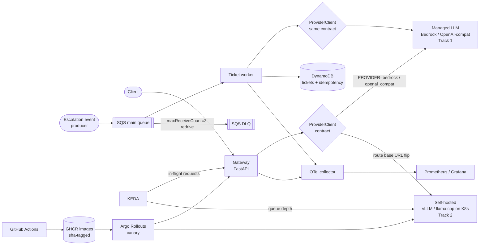
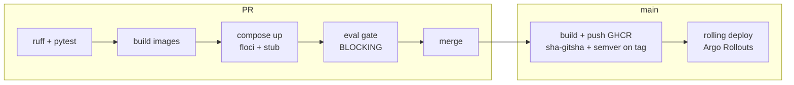

# Regulated Conversational AI — MLOps Platform

This repository is a take-home build of the MLOps surface for a regulated bank's
conversational-AI platform. It spans two tracks that share one operational spine.
**Track 1** is a managed-LLM gateway (FastAPI) that fronts a third-party inference
provider with production-grade resilience, streaming with graceful drain, an
eval-gated CI pipeline, versioned prompts, cost/latency observability,
concurrency-based autoscaling, and an event-driven ticket-drafting worker.
**Track 2** is self-hosted, OpenAI-compatible model serving — CPU-only locally,
GPU-ready in production. The thesis tying them together: *serve managed inference
today, migrate to self-hosted models on EKS GPU nodes tomorrow, behind one
OpenAI-compatible contract so the switch is a config change per route, not a
rewrite.* Everything runs locally on free tooling; AWS services are emulated with
[floci](https://github.com/floci-io/floci) (a LocalStack-successor, MIT-licensed,
`localhost:4566`) so the same code paths that talk to SQS, DynamoDB, Secrets
Manager, ECR, and Bedrock in production run unchanged against local emulation.

## System overview



The gateway and the worker both reach models through the **same
`ProviderClient` contract**, which is the pivot the whole platform turns on:
one abstraction fronts managed inference (Track 1) and self-hosted serving
(Track 2), so resilience, evals, observability, and rollout policy are authored
once and apply to both backends.

## Track 1 — Managed LLM gateway

### Provider abstraction

The gateway depends only on a `ProviderClient` protocol exposing `complete()`
(unary) and `stream()` (chunked). Two adapters implement it:

- **`openai_compat`** — an OpenAI-compatible HTTP client. The same adapter fronts
  the local deterministic stub, the Track 2 self-hosted server, or any managed
  OpenAI-compatible API. Backend is a base-URL change.
- **`bedrock`** — a boto3 client using the Bedrock `Converse` / `ConverseStream`
  APIs, with `endpoint_url` pointed at floci locally and real AWS in production.

Selection is by the `PROVIDER` environment variable. Locally, the "managed
provider" is a **deterministic FastAPI stub** with runtime-configurable fault
injection (429 / 5xx / added latency, driven through a `POST /__faults` control
endpoint). The stub is chosen over floci's Bedrock stub for the primary local
path because evals and retry tests need *deterministic content* and *injectable
failures*; floci's Bedrock Runtime endpoint is still exercised by the `bedrock`
adapter as a smoke test so the boto3 code path is covered.

### Resilience & error contract

Every provider call runs under a bounded retry policy:

- **Per-attempt timeout** 10 s; **total budget** 30 s; **max 3 attempts**.
- Retry **only** on `429, 500, 502, 503, 504`; exponential backoff with **full
  jitter**; honor `Retry-After` when present.
- **Never retry once a stream has emitted bytes** — a partially delivered SSE
  response cannot be replayed without duplicating tokens to the client.

Failures collapse into a single error envelope:

```json
{
  "error": {
    "code": "provider_timeout|provider_rate_limited|provider_unavailable|bad_request",
    "message": "human-readable summary",
    "retryable": true,
    "request_id": "uuid"
  }
}
```

mapped to HTTP status as: `provider_timeout → 504`,
`provider_rate_limited → 429`, `provider_unavailable → 502`,
`bad_request → 400`.

### Streaming & graceful drain

The gateway exposes an SSE streaming endpoint. A rolling deploy must never cut an
open stream shorter than the drain budget, so shutdown is choreographed:

- `terminationGracePeriodSeconds: 180` on the pod.
- `preStop: sleep 10` — lets endpoint-slice removal propagate through kube-proxy
  so no *new* connections are routed to a terminating pod before it stops
  accepting them.
- On `SIGTERM`, **readiness flips to 503** (the pod leaves the Service endpoints)
  while **liveness stays 200** (the kubelet does not kill it).
- An in-flight counter (`DrainState`) keeps the process alive until open streams
  finish, bounded at **160 s**; uvicorn graceful shutdown handles connection
  teardown after that.

**Invariant:** a rolling deploy never cuts an open stream shorter than the grace
budget.

### Prompt versioning

Prompts live in-repo at `prompts/<name>/vX.Y.Z.yaml`. Each environment overlay
pins an explicit `PROMPT_VERSION`; a kustomize `configMapGenerator` (hash-suffixed)
mounts exactly the pinned version. Consequences:

- **No `latest`** — every environment runs a named, immutable version.
- A prompt change is a **PR + rollout**, reviewable as a diff, never a code edit.
- Rollback is `git revert` plus the previous (still-present) hash-suffixed
  ConfigMap; because the ConfigMap hash is part of the pod template, a prompt
  rollback rides the same canary path as a code rollback.

### Observability

Prometheus metrics:

| Metric | Type | Labels |
| --- | --- | --- |
| `gateway_tokens_total` | counter | `direction, route, model, provider` |
| `gateway_request_duration_seconds` | histogram | `route, model, provider` |
| `gateway_ttft_seconds` | histogram (stream only) | `route, model` |
| `gateway_cost_usd_total` | counter | `route, model` |
| `gateway_inflight_requests` | gauge | `route` |

Cost is derived from a repo-versioned price table
(`services/gateway/config/prices.yaml`) so the `$/1k token` assumptions are
reviewable and change under version control. Traces are exported via OTLP to an
OpenTelemetry collector, with FastAPI auto-instrumentation plus explicit spans
around each provider call. One Grafana dashboard (JSON checked into
`deploy/k8s/base/observability/`) renders latency / TTFT and token / cost panels
per route.

**PII handling.** A regex scrubber (emails, phone numbers, PAN via Luhn check,
IBAN / account patterns) is applied to anything exported; raw prompts and
completions are **never exported by default**. Honest gap: regex catches
structured identifiers but misses names, addresses, free-text context, and novel
formats. Production-grade PII redaction needs an NER pass (listed under *What I'd
do next*); the regex layer is a floor, not a guarantee.

### Autoscaling

A KEDA `ScaledObject` uses a Prometheus scaler on `gateway_inflight_requests`,
targeting ~20 in-flight requests per pod. Justification: the workload is
**I/O-bound on provider latency**. CPU stays flat while concurrency saturates
connection pools and provider quotas, so CPU-based HPA would essentially never
scale up under real load. In-flight request count is the *direct* saturation
signal for a proxy that spends its time awaiting an upstream.

### Event-driven ticket worker

When an interaction is escalated, a ticket must be drafted by the LLM. This is a
**work-queue** job, so it runs off SQS:

1. Escalation event lands on the **SQS main queue**.
2. Worker long-polls, receives the message, and **claims idempotency** via a
   DynamoDB conditional put on an idempotency key derived from the event.
3. On a fresh claim, the LLM drafts the ticket through the **same
   `ProviderClient`** and a **versioned prompt**.
4. The ticket is persisted to the DynamoDB tickets table.
5. The SQS message is deleted (ack).

**Poison-message path:** processing raises → message not deleted → visibility
timeout expires → redelivery → after `maxReceiveCount=3`, SQS redrive moves the
message to the **DLQ**, whose depth is alarmed. A redelivered message that was
*already* processed hits the idempotency condition-check failure and is acked
without re-executing the side effect.

**Why SQS over Kafka:** ticket drafting needs competing consumers, per-message
ack, and a native DLQ — not ordering, replay, or fan-out. SQS provides DLQ via
`maxReceiveCount` redrive natively and floci emulates it faithfully. Kafka would
buy replay and ordering we don't need at the cost of running and operating
brokers.

## Track 2 — Self-hosted model serving

### Serving deployment

An OpenAI-compatible server runs as a Deployment + Service. Local and CI use the
`ghcr.io/ggml-org/llama.cpp` server image with **Qwen2.5-0.5B-Instruct Q4 GGUF**.
An initContainer downloads the pinned GGUF from Hugging Face (by URL + sha) into
an `emptyDir`, keeping the image generic while pinning the model artifact.
Readiness and liveness probe `/health`; the server runs with `--metrics` enabled
so the scaler has a queue signal to read.

### Local ↔ production mapping

| Concern | Local / CI | Production |
| --- | --- | --- |
| Runtime | llama.cpp (CPU) | vLLM (GPU) |
| Model | Qwen2.5-0.5B-Instruct Q4 | production-grade model |
| Node | any node | GPU node group |
| Scaling signal | llama.cpp `/metrics` queue | vLLM `vllm:num_requests_waiting` |

Because both runtimes speak the OpenAI-compatible API, the gateway adapter and
the eval suite do not change across this boundary.

### GPU-readiness

The production overlay is **authored in-repo but not applied locally**. It adds:

- `resources: { limits: { nvidia.com/gpu: 1 } }`
- `nodeSelector: { node-pool: gpu }`
- toleration for taint `nvidia.com/gpu=present:NoSchedule`
- **Dependency note:** the NVIDIA device plugin (EKS addon / DaemonSet) must be
  installed to publish the `nvidia.com/gpu` extended resource, or the pod stays
  `Pending`.

Key vLLM flags, one line each:

- `--gpu-memory-utilization 0.90` — KV-cache headroom vs. OOM risk.
- `--max-num-seqs` — admission concurrency: throughput vs. per-request latency.
- `--tensor-parallel-size` — shard a model larger than one GPU's memory across
  GPUs.
- `--quantization awq` — fit bigger models / raise throughput at a small quality
  cost.

### GPU-appropriate autoscaling

KEDA scales the serving Deployment on **request queue depth**
(`vllm:num_requests_waiting`; locally the llama.cpp metrics equivalent — *exact
metric name to be verified at build time; pre-decided fallback is a gateway-side
per-upstream in-flight gauge*). Why not CPU / GPU utilization: a saturated batch
engine shows **high utilization in both healthy and overloaded states**, so
utilization cannot distinguish "busy" from "falling behind." Queue depth is the
**leading indicator** of a latency-SLO breach.

**Scale-to-zero.** KEDA `minReplicaCount: 0` plus an HTTP add-on (or a thin
activator) buffers the first request while a replica spins up. This is honest
about cold start: loading a GPU model is on the order of **minutes**, so
scale-to-zero is applied only to idle / off-peak pools, mitigated with a
pre-warmed node and an image + model cache so the cold path is model-load, not
also image-pull.

## Bridging the tracks

This is the managed → self-hosted judgment the assessment asks for. Because both
backends speak the **same OpenAI-compatible contract**, migrating a route is a
**base-URL flip per route / intent** in the gateway. Everything else the platform
enforces — evals, observability, canary analysis, the error contract — applies
**unchanged** to both backends. Concretely:

- A quality regression introduced by switching backends is caught by the **same
  eval gate** and the **same canary analysis** that guard code and prompt
  changes.
- The migration path is a **route-level canary**: shift traffic percentage from
  managed to self-hosted per intent, watching the same SLO and quality signals.
- `gateway_cost_usd_total` and `gateway_tokens_total`, labeled by route and
  model, make the **build-vs-buy line item measurable per route** — you can see
  the cost delta of self-hosting a given intent before committing to it.

## Shared platform

### CI/CD



- **PR pipeline:** lint + tests → build images → `compose up` (floci + stub) →
  **blocking eval gate** → merge allowed.
- **Main pipeline:** build and push to GHCR with **immutable tags**
  (`sha-<gitsha>`, plus semver on a git tag) → rolling deploy via Argo Rollouts.
- Promotion always references the **immutable sha tag**; `latest` is never
  deployed.

### Eval gate design

- **Deterministic cases** must pass **100%** (exact/regex/JSON-schema assertions).
- **Judged cases** run **N=5** against the judge and pass on a **≥4/5 majority**.
- **Suite gate:** overall pass-rate **≥ 90%**, else CI fails.

Distinguishing a real regression from judge variance: a genuine regression fails
the majority vote **consistently** (0–1 of 5 pass); variance shows up as **3–4/5
splits**. The report artifact records **per-case vote counts**, and only majority
failures block the merge. In CI the judge is the **deterministic stub** (hermetic,
reproducible); an optional **nightly** run points the judge at the real llama.cpp
server for realism.

### Secrets

No plaintext secrets in the repo.

- **Local:** `scripts/seed-aws.sh` writes the provider credential into floci
  Secrets Manager; `scripts/deploy-local.sh` materializes it as a Kubernetes
  Secret consumed as an env var.
- **Production:** the External Secrets Operator syncs AWS Secrets Manager → a
  Kubernetes Secret via IRSA; the IAM role is documented in the Terraform `iam`
  module.

### Controlled rollout — canary, explained

1. **Why canary, not blue/green.** An LLM regression is *silent quality loss*:
   the pod is healthy, probes pass, error rates don't spike, latency looks fine —
   the answers just get worse. Blue/green flips 100% of traffic on evidence you
   don't have. Canary sends a **small slice** to the new version and **gathers
   evidence before full exposure**, which is the only way to catch a quality-only
   regression in production traffic.
2. **Mechanism.** Argo Rollouts replaces the Deployment with a `Rollout` CR whose
   steps are: `setWeight: 20` → `pause` + analysis → `setWeight: 50` → analysis →
   `100%`. The `AnalysisTemplate` queries Prometheus for **error rate < 2%**,
   **p95 latency within SLO**, and **`canary_probe_success` ≥ threshold**. The
   last metric is emitted by a **canary-prober Job** that replays golden prompts
   against the canary Service and runs the deterministic eval assertions — i.e.
   the eval suite acting as a **runtime quality signal**, not just a CI gate.
3. **Rollback.** A failed analysis **auto-aborts**: traffic returns to stable
   instantly because the stable ReplicaSet never went away. Manual
   `kubectl argo rollouts abort` / `undo` is also available. A prompt change rides
   the identical path, because the ConfigMap hash is part of the pod template.

### IaC

Terraform lives under `deploy/terraform` with modules `sqs` (main + DLQ +
redrive), `dynamodb` (idempotency + tickets tables), `ecr`, `secrets`, `iam`
(IRSA roles), and `eks` (cluster + default node group + GPU node group with taint
`nvidia.com/gpu=present:NoSchedule`). Local apply targets floci via a provider
`endpoints {}` override plus `skip_credentials_validation` (wired in
`envs/local.tfvars`); the `eks` module is **validate / plan-only**.

Explicit split:

- **Applied locally against floci:** `sqs`, `dynamodb`, `ecr`, `secrets`.
- **Authored and `validate` / `plan`-only:** `eks`, `iam`.

This matches the assessment's allowance for "manifests plus a documented
Terraform equivalent" for the cluster itself.

## Local ↔ AWS service mapping

| AWS service | Local emulation | What changes in production |
| --- | --- | --- |
| EKS | kind cluster | Real EKS via the validated Terraform `eks` module (GPU node group + taint) |
| ECR | floci ECR (backed by `registry:2`) / GHCR for CI images | Real ECR or GHCR; same immutable sha tags |
| Bedrock | deterministic FastAPI stub (+ floci Bedrock smoke) | Real Bedrock Runtime; `bedrock` adapter drops `endpoint_url` |
| SQS | floci SQS | Real SQS; same queue + DLQ + redrive config from Terraform |
| Secrets Manager | floci Secrets Manager | Real Secrets Manager synced via External Secrets Operator + IRSA |
| DynamoDB | floci DynamoDB | Real DynamoDB; same table schemas from Terraform |
| CloudWatch | Prometheus + Grafana | Prometheus + Grafana (or CloudWatch); metric names unchanged |

floci runs as `floci/floci:latest` on port `4566` with dummy credentials; the
application code differs from production only in the `endpoint_url` it is handed.

## Repository layout

```
.
├── README.md                  # this document
├── LICENSE
├── Makefile                   # up, seed, kind-up, deploy-local, eval, test, lint, smoke-drain
├── docker-compose.yml         # floci:4566 + provider-stub; profile "selfhosted": llama.cpp
├── pyproject.toml             # uv workspace root
├── services/
│   ├── gateway/               # Track 1 managed-LLM gateway (FastAPI)
│   ├── provider-stub/         # deterministic OpenAI-compatible stub w/ fault injection
│   └── ticket-worker/         # SQS-driven ticket-drafting consumer
├── evals/                     # pytest eval harness + case schemas (the CI gate)
├── prompts/                   # versioned prompt store (prompts/<name>/vX.Y.Z.yaml)
├── deploy/
│   ├── k8s/                   # kustomize bases + local/prod overlays
│   └── terraform/             # sqs, dynamodb, ecr, secrets, iam, eks modules
├── .github/workflows/         # ci.yml (PR gate) + cd.yml (build/push/deploy)
└── scripts/                   # bootstrap-local, seed-aws, deploy-local, publish-test-event, smoke-stream-drain
```

## Quickstart

*(Build in progress on `scaffold/project-structure`; steps below are the intended
developer workflow.)*

```bash
make up            # start floci + provider-stub via docker compose
make seed          # create SQS queues+DLQ, DynamoDB tables, Secrets Manager secret in floci
make kind-up       # create kind cluster; install KEDA, Argo Rollouts, kube-prometheus-stack
make deploy-local  # build/load images into kind, apply the local kustomize overlay
make eval          # run the eval suite against the gateway (the CI gate, locally)
make smoke-drain   # open an SSE stream, trigger a rollout, assert the stream completes
```

## What I'd do next

1. **NER-based PII scrubbing** to cover names, addresses, and free-text context
   the regex floor misses.
2. **Shadow traffic replay** — mirror a slice of production prompts against a
   candidate backend to gather quality/cost evidence before a canary.
3. **Per-tenant cost budgets** with enforcement, built on the existing
   `gateway_cost_usd_total` labeling.
4. **vLLM prefix caching** for shared system-prompt prefixes to cut prefill cost
   on the self-hosted track.
5. **Multi-region** active/active for the gateway with regional provider failover.
